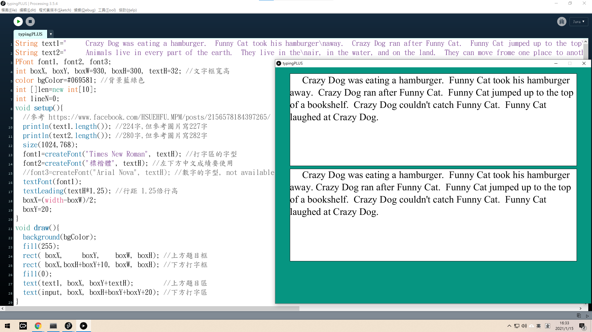

PLUS-style打字遊戲
==================

Background 背景說明
-------------------
因為我兒子非常著迷補習班(PLUS普拉斯)的打字遊戲。所以我就在他生日的這天, 模仿補習班的打字介面, 寫了一個程式, 讓我兒子可以每天在家練習打字/衝排名。


More Details 補充說明
---------------------
原本用許多 Processing 關於 String 字串 及 text() 顯示字串 相關的函式。
因想準確顯示出多行文字/自己進行排版。但後來發現 text()可用\n跳行, 這就簡單了。

目前這個版本, 只完成顯示文字/打字。

TODO: 還沒計分, 還沒 cursor, 還沒紅色顯示打錯的部分。

Reference 目錄裡, 有 學府文教機構 貼出來的圖片, 我照著量出字的長寬。
https://www.facebook.com/HSUEHFU.MPM/posts/2156578184397265/



Code Explain 程式碼說明
-----------------------

```Processing
//參考 https://www.facebook.com/HSUEHFU.MPM/posts/2156578184397265/ 模仿照片中PLUS普拉斯打字系統的畫面
String text1="     Crazy Dog was eating a hamburger.  Funny Cat took his hamburger\r\n"
           + "away.  Crazy Dog ran after Funny Cat.  Funny Cat jumped up to the top\r\n"
           + "of a bookshelf.  Crazy Dog couldn't catch Funny Cat.  Funny Cat\r\n"
           + "laughed at Crazy Dog."; //使用 Java String 字串 + 增加可讀性 //參考圖片寫227字, 表示跳行為Windows的\r\n
String text2="     Animals live in every part of the earth.  They live in the air, in the\r\n"
           + "water, and on the land.  They can move from one place to another.  A\r\n"
           + "cow, a bird, a fish, a sheep, and a snake are all animals.  Butterflies,\r\n"
           + "eagles, elephants, goldfish, and people are all animals, too."; //參考圖片寫282字, 表示跳行為Windows的\r\n
String textQ=text1; //text of Question: text1 of text2 解決 text1 及 text2 切換的問題
PFont font1, font2, font3;
float scaleX=1, scaleY=1;//可針對不同解析度螢幕來縮放。 下一行則推算box的寬高、位置、字型大小
int boxW=930, boxH=300, boxX=(1024-boxW)/2, boxY=20, textH=32; //文字框寬高,畫面以1024x768為基準
color bgColor=#069581; //背景藍綠色
void setup(){
  fullScreen(); //size(1024,768);
  scaleX=width/1024.0; //原本程式解析度是1024x768, 縮放到全螢幕
  scaleY=height/768.0;
  font1=createFont("Times New Roman", textH); //打字區的字型
  font2=createFont("標楷體", textH); //左下方中文成績要使用
  font3=createFont("Arial", textH*1.5);
  textFont(font1);
  textLeading(textH*1.25); //行距 1.25 倍行高
  textAlign(LEFT, TOP); //對齊左上角,讓 text() 座標簡化
  ((java.awt.Canvas) surface.getNative()).requestFocus(); //解決 fullScreen() focus 的問題, 才能打字
} //參考 https://discourse.processing.org/t/sketch-does-not-always-have-focus-on-start-up/16834/5
void draw(){
  background(bgColor);
  scale(scaleX,scaleY); //原本程式解析度是1024x768, 縮放到全螢幕
  fill(255);
  stroke(0);
  rect(boxX, boxY,         boxW, boxH); //上方題目框
  rect(boxX, boxY+boxH+10, boxW, boxH); //下方打字框
  fill(0);
  textFont(font1);
  textLeading(textH*1.25); //行距 1.25 倍行高
  text(textQ, boxX+3, boxY);         //上方題目區
  text(input, boxX+3, boxY+boxH+20); //下方打字區
  drawRedCharacter();   //上方題目區的對應位置,放紅底線+紅字母
  drawInsertionPoint(); //下方打字區的游標插入直線 | 
  drawElapsedTime();
}
void drawElapsedTime(){
  noStroke();
  fill(148);
  ellipse( 140, 720, 360, 60);
  fill(#2EF0E1);
  float a=51;
  arc( 140, 720, 300, 50, radians(a), radians(180-a), CHORD);
  arc( 140, 720, 300, 50, radians(a+180), radians(180-a+180), CHORD);
  rect(boxX, 720-20, 185, 40);
  fill(0);
  textFont(font3);
  int sec=(millis()/1000);
  int mm=int(sec/60), ss=int(sec%60), sss=int(millis()/10)%100;
  text(nf(mm,2)+":"+nf(ss,2), boxX+20, 720-30);
  textSize(18);//每次 textSize()之後, 會 textLeading(48), 所以下一行要再一次 textLeading
  textLeading(textH*1.25); //行距 1.25 倍行高
  text(nf(sss,2), boxX+150, 720);
}
void drawRedCharacter(){ //模仿 drawInsertionPoint() 去計算 lineN 及 x座標
  int N=input.length();
  if(N>=textQ.length()) return; //如果打到最後一個字會當掉, 因為找不到 textQ.charAt(N), 所以避開
  char c=textQ.charAt(N);
  String substr=textQ.substring(0,N+1);
  int lineN=0, now=0;
  while( substr.indexOf("\r\n", now) != -1 ){
    lineN++;
    now=substr.indexOf("\r\n", now) + 2;
  }
  float x=boxX+3+textWidth(substr.substring(now))-textWidth(c); //要減掉 c 的字母寬
  fill(255,0,0);
  text(c, x, boxY+lineN*textH*1.25);  
  text("_", x, boxY+lineN*textH*1.25); //TODO: 這裡的 _ 寬度不漂亮, 應該用 line() 畫
}
void drawInsertionPoint(){//下方打字區的游標(Insertion Point)插入直線 | 
  // textWidth() 是全部文字的寬度, 遇到跳行就不適合了。所以要查出已有幾行(lineN)
  int lineN=0, now=0; //最後計算出 lineN 及 x座標
  while( input.indexOf("\r\n", now) != -1 ){ //還找得到跳行的話
    lineN++;
    now=input.indexOf("\r\n", now) + 2;
  }
  float x=boxX+3+textWidth(input.substring(now));
  line(x, boxY+boxH+20+lineN*textH*1.25, x, boxY+boxH+20+lineN*textH*1.25+textH*1.25);
}
String input=""; //TODO: 重新開始時, 需將 input="" 清空
void keyPressed(){
  if(key==BACKSPACE){ //按下 BackSpace 倒退鍵
    if(input.length()>0){ //如果有字可倒退, 就倒退1字元
      input = input.substring(0, input.length()-1); 
    }
  }else if(key==TAB){ //按下 TAB 鍵
    input += "     "; //普拉斯系統的 TAB 鍵代表5個空格
  }else if(key==ENTER){ //按下 Enter 鍵, 表示跳行
    input += "\r\n"; //跳行, 可配合 text() 的\n功能, 配合 textLeading() 行距顯示
  }else if(key==ESC){ //按下 ESC 鍵, 進行算分
    //key = 0; // 但 ESC 也表示結束程式, 所以要把 key 改掉, 避免結束
    //https://forum.processing.org/one/topic/ignore-escape-key-do-other-action.html
    //TODO: 算分 calculate the score!
  }else if(key==CODED){ //按下特殊鍵, 如 SHIFT, CTRL, ALT 等
    //Do nothing, 不記錄CODED特殊鍵
  }else{ //如果按下 普通字母/符號按鍵, 記錄下來
    input += key; //記錄下來
  }
}
```
